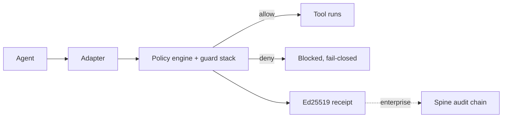

# D — Anti-Slop README Audit

**Debater:** D
**Working file:** `/Users/connor/Medica/backbay/standalone/clawdstrike/README.md` (1,126 lines, HEAD `2eff91532`)
**Stance:** if a CTO can't immediately distinguish this README from a generic-OSS-template README, it's slop. The current README fails that test.

---

## 1. My stance — what is "AI slop" vs. "human-written"?

A README is **AI slop** when it reads like it was assembled from a thesaurus and a list of "what a serious OSS project should have." Specific markers:

- **Texture is smooth where it should be jagged.** Real engineers have weird, specific phrasings. AI smooths them out.
- **Sentences hedge.** "Comprehensive," "robust," "seamlessly," "leverage," "first-class." None of these reduce to a fact.
- **Em-dashes do feature work.** Not for parentheticals. For sounding clever. The 2025+ AI tell.
- **Structure obeys the template.** Hero → tagline → "Why X" → "Features" → "Getting Started" → "Comparison" → "Architecture" → "FAQ" → "Contributing" → "License". A reader has seen this README 400 times.
- **Repetition tries to brand a phrase.** "Every action. Every agent. Every time." That's marketing trying to be a chant.
- **Tables that don't earn their geometry.** Two-column "Without X / With X" tables are the AI tell par excellence. Tables that compare nothing actually being compared.
- **Bullets that read like a recruiter rephrased them.** Three sub-bullets in `**Bold thing.** Description.` form, three times in a row, are AI.

A README is **human-written** when:
- It has at least one phrase only this author would use.
- The visuals teach (mermaid that maps a real flow) instead of decorate (sigils, dividers, mood poetry).
- The voice doesn't ask permission. No "we know you might be wondering…". No "imagine if…".
- The structure follows the **product**, not the **template**. If the product is a daemon, the README is daemon-shaped. If it's an SDK, the README opens with the import line.

Clawdstrike is a Rust daemon + SDK + plugin set + CLI + enterprise console. The README should be cli-and-code-shaped. The current README is mood-board-shaped.

---

## 2. The slop catalog

### 2a. Em-dash audit — 13 in 1,126 lines (technically 1 per 87 lines; the *placement* is what matters)

| Line | Quote (em-dash region) | Verdict |
| ---- | ---------------------- | ------- |
| 72 | `…built for defined, static attacks — not continuous, goal-driven agentic behavior.` | **MID.** Parenthetical contrast. Could be a comma. Em-dash is doing rhetorical lift. |
| 80 | `Clawdstrike enforces policy at the tool boundary — fail-closed, with signed proof.` | **AI TELL.** Classic appositive-with-em-dash, the literal signature move of LLM prose. Should be a period: "Clawdstrike enforces policy at the tool boundary. Fail-closed. Signed proof." |
| 298 | `…risk across turns — a slow-burn attack that stays below the per-message threshold still gets caught.` | **MID.** Genuinely an aside, but the sentence is already long. Period would land harder. |
| 500 | `Clawdstrike ships as a first-class [OpenClaw](…) plugin that enforces policy at the tool boundary — every tool call your agent makes is checked…` | **AI TELL + DOUBLE OFFENSE.** "First-class" + dash-appositive. Both slop markers in one sentence. |
| 793 | `The ML layer is a configurable linear model with sigmoid activation — weights live in your YAML policy, not a black box.` | **OK.** Actually a real-content aside ("not a black box" is a substantive claim). One of the legitimate dashes. Keep. |
| 797 | `An attacker who spreads a jailbreak across 20 innocuous messages still triggers detection — their score rises until it crosses the threshold.` | **AI TELL.** "Sentence — restating the sentence." This is the pattern. Period would do. |
| 845 | `…modified content — guards can redact or rewrite dangerous payloads instead of outright blocking.` | **AI TELL.** Restatement. Drop the dash, drop the comma after, make it a separate sentence. |
| 865 | `**Threat feeds:** VirusTotal, Snyk, Google Safe Browsing — with circuit breakers, rate limiting, and caching.` | **OK.** Genuine list-then-qualifier. Keep. |
| 867 | `Note: the original paper proposes agent-intrinsic risk sensing — our adaptation applies the screening hierarchy as middleware…` | **OK.** Real contrast, distinguishing the paper from the implementation. Legitimate. |
| 1018 | `### Spine — Tamper-Evident Audit Trail` | **AI TELL.** Header-with-em-dash is the OSS-template move. Two-word concept, em-dash, three-word explainer. Pure scaffolding. |
| 1040–1042 | Table cells: `KV watch — policy updates propagate…` × 3 | **MID.** All three table cells use em-dash as a "here's what this row means" splitter. Fine geometrically; lazy stylistically. Could be a colon. |

**Em-dash slop verdict:** 6 of 13 dashes are AI tells (placement, not just count). Two are legitimate (lines 793, 867). The cluster at L1040-1042 is mechanical, not clever-sounding, so it gets a pass but a colon would read cleaner.

User's instinct ("hella em dashes") is **directionally right**: even at 13, the *placement* in the rhetorical-pivot positions (L80, L500, L797, L845, L1018) is exactly where AI prose loves to put them. Strip those five and the README's voice tightens immediately.

### 2b. Hedge-word audit

| Word | Count | Lines | Verdict |
| ---- | ----- | ----- | ------- |
| `comprehensive` | 0 | — | clean |
| `robust` | 0 | — | clean |
| `seamlessly` | 0 | — | clean |
| `leverage` | 0 | — | clean |
| `production-ready` | 0 explicit, but `production-hardened` at L139 | one | borderline — the negation "Not yet production-hardened" is a useful disclaimer, not slop |
| `enterprise-grade` | 0 | — | clean |
| `industry-leading` | 0 | — | clean |
| `cutting-edge` | 0 | — | clean |
| `first-class` | 1 | L500 (`first-class [OpenClaw] plugin`) | **SLOP.** Pure marketing. Delete or replace with "native." |
| `powerful` | 0 | — | clean |
| `elegant` | 0 | — | clean |
| `simply` / `effortlessly` | 0 | — | clean |

**Hedge-word slop verdict:** the README is **surprisingly clean** on the worst tier of marketing adjectives. One "first-class" at L500. That's the entire hedge-word offense. Credit where due — this is well below typical OSS-AI-rewrite levels.

What it *does* have is **synthetic-sounding compound nouns** that aren't on the cliché list but reek of LLM phrasing:

- L84 `cryptographic attestation runtime` — that's a phrase. Is it a real category, or did a model generate it? Real category would have a Wikipedia page.
- L106 (table cell) `cryptographic capability ceilings` — same. Sounds technical, but the phrase exists only in this README.
- L1092 `cryptographic capability ceilings` (again) — branded.
- L102 `non-repudiable receipt` — fine, that's a real cryptographic term.
- L92 `Canonical Action Event` — capital-letters-as-jargon. See §2i.

### 2c. Generic section headers

Scoring each `##`/`###` for "doing work" vs. "scaffolding":

| Line | Header | Verdict |
| ---- | ------ | ------- |
| L70 | `## The Problem` | **SLOP.** OSS-template move #1. Every AI-rewritten README has "The Problem". Could be deleted; the first paragraph would still land. |
| L82 | `## What Clawdstrike Is` | **SLOP.** OSS-template move #2. "What X Is" is the most generic header on Earth. Better: `## Clawdstrike` (just the name, because the project name *is* the topic). |
| L112, L123 | `### Without Clawdstrike` / `### With Clawdstrike` | **SLOP.** OSS-template move #3, the "before/after" comparison table. See §2f. |
| L141 | `## Quick Start` | **OK.** Generic but load-bearing. Readers grep for this. |
| L153–243 | `#### Install` / `#### Initialize` / `#### Start the Daemon` / `#### Enforce` / `#### Verify` / `#### Hunt` | **OK.** Verbs but they describe the action being demonstrated. Earn their place. |
| L242 | `### Desktop Agent (Recommended)` | **OK.** Real product surface. |
| L282 / L381 / L443 / L498 / L511 / L529 | Language and plugin headers (`### TypeScript`, `### Python`, `### Go`, `### OpenClaw Plugin`, `### Claude Code Plugin`, `### Cursor Plugin`) | **OK.** Real product surfaces. |
| L545 | `### Observe -> Synth -> Tighten` | **OK** — actually a specific product workflow with a memorable arrow phrasing. Earns it. |
| L623 | `### Spider-Sense Quick Start` | **OK.** Specific. |
| L653 | `### Additional SDKs & Bindings` | **SLOP-ADJACENT.** Generic, but it's a footer-ish list section. Mild. |
| L661 | `## Core Capabilities` | **SLOP.** Could be `## Capabilities` or just deleted in favor of the existing capability subsections. "Core" adds nothing. |
| L676 | `### Guard Stack` | **OK.** Real product term. |
| L695 | `### Policy System` | **OK.** Real product term. |
| L728 | `### Formal Verification` | **OK.** Real claim. |
| L762 | `### Computer Use Gateway` | **OK.** Real product surface. |
| L782 | `<h3 align="center">Jailbreak Detection</h3>` | **OK** as a topic header but the centering is decorative. Strip the inline style. |
| L809 | `### Multi-Agent Security Primitives` | **OK.** Real product surface. |
| L827 | `#### Inline Reference Monitors` | **OK.** Real product. |
| L842 | `#### Output Sanitization` | **OK.** Real product. |
| L852 | `#### Cryptographic Receipts + Prompt Watermarking` | **MID.** Two things glued together by a `+`. Probably two sections in one card because the layout forced it. |
| L863 | `#### Threat Intel · Spider-Sense · WASM` | **MID.** Three unrelated things glued together. Layout artifact. |
| L877 | `## Deployment Modes` | **OK.** Real product axis. |
| L887 | `### Adaptive Engine` | **OK.** Real product name. |
| L916 | `## Enterprise Architecture` | **OK** topic but **SLOP** in scope — this section is 165 lines (see V-30 from D01). Should be moved to `docs/`. |
| L920 / L959 | `### 1. Control Plane` / `### 2. Telemetry Plane` | **OK.** Real architecture. |
| L998 | `### Enrollment` | **OK.** |
| L1018 | `### Spine — Tamper-Evident Audit Trail` | **SLOP** — em-dash header. See §2a. |
| L1034 | `### Real-Time Fleet Management` | **MID.** "Real-Time" is a hedge — what would non-real-time fleet management look like? Could just be `### Fleet Management`. |
| L1046 | `### Kill Switch` | **GOOD.** Two words, strong, specific. Best header in the doc. |
| L1056 | `### Control Console` | **OK.** Product name. |
| L1068 | `### Compliance Mapping (Current + Planned)` | **OK.** The "(Current + Planned)" is unusually honest — refreshing. |
| L1084 | `## Design Principles` | **MID** — OSS-template-ish but the four principles below it are voice-y enough to earn the section. |
| L1098 | `## Documentation` | **OK.** Functional link table. |
| L1109 | `## Security` | **OK.** |
| L1116 | `## Contributing` | **OK.** |
| L1124 | `## License` | **OK.** |

**Header slop verdict:** "The Problem" + "What Clawdstrike Is" + "Without/With" cluster + "Core Capabilities" + "Spine — Tamper-Evident Audit Trail" + "Real-Time Fleet Management" = **6 slop headers** out of ~50. Headers that *start with a verb in the present participle* (banned by my rules) are absent; that's a small win.

### 2d. Pseudo-empathy

Scan for "We know you're frustrated…", "Imagine a world…", "Tired of X?", etc.

**Zero direct hits.** No "imagine if," no "tired of," no "we know you're frustrated." Credit where due.

The closest the README comes is L72-79 (the "Shadow Agent crisis" paragraph) which constructs a hypothetical — "Your org provisioned 50 agents. Shadow IT spun up 50 more…" — but it's specific enough (the numbers, the chmod 777, the SIEM-stays-green observation) that it reads as journalism, not empathy-bait. **Keep this paragraph.** It's the strongest prose in the doc.

### 2e. Marketing-tone bullets

Marketing-tone bullets fail to reduce to a fact. Audit:

L114-118 (`Without Clawdstrike` bullets):
- `Agent reads ~/.ssh/id_rsa. You find out from the incident report` — **FACT.** Specific. Keep.
- `Secret leaks into model output. Compliance discovers it 3 months later` — **FACT-ISH.** "3 months later" is rhetorical but the structure is concrete.
- `Jailbreak prompt bypasses safety. No one notices until the damage is public` — **MARKETING.** Vague; what damage? Trim.
- `Multi-agent delegation escalates privileges. Who authorized what?` — **MARKETING.** The rhetorical question is the AI tell.
- `"We have logging." Logs are stories anyone can rewrite` — **VOICE.** Actually good. This is the one line in the section that sounds like a human said it.

L125-129 (`With Clawdstrike` bullets):
- `ForbiddenPathGuard blocks the read, signs a receipt` — **FACT.** Names the guard. Keep.
- `OutputSanitizer redacts the secret before it ever leaves the pipeline` — **FACT.** Good.
- `4-layer jailbreak detection catches it across the session, even across multi-turn grooming attempts` — **MARKETING.** "Even across multi-turn grooming attempts" is brochure prose.
- `Delegation tokens with cryptographic capability ceilings. Privilege escalation is mathematically impossible` — **MARKETING.** "Mathematically impossible" overclaims (capability attenuation makes it *cryptographically infeasible*, not "mathematically impossible," which would require a proof — which Clawdstrike actually does have, but the receipt for that proof is in Lean, not in the README. So this lands as overclaim).
- `Ed25519 signed receipts. Tamper-evident proof, not narratives` — **VOICE.** Good. "Not narratives" is voice.

L800-803:
- `[Try this out for yourself in our Attack Range!](https://backbay.io/attack-range)` — **MARKETING.** The exclamation point is the smoking gun. Exclamation points belong in shell prompts, not in README CTAs.

L135: `**Every action. Every agent. Every time. No exceptions.**` — **MARKETING SLOGAN.** This is a chant. See §2h.

L824-875 (the four-card grid `Inline Reference Monitors / Output Sanitization / Cryptographic Receipts / Threat Intel`):
Each card has bullets of the form `**Topic.** Brief sentence. Brief sentence.` This is the **classic AI-rewrite three-by-three grid**: four cells, each a perfectly balanced 2-3 sentence summary with bold-leading-phrase. Real product docs have asymmetric sections because the products themselves are asymmetric. This grid's symmetry is the tell.

### 2f. False-balance tables

**L108–133:** The `### Without Clawdstrike` / `### With Clawdstrike` table. **TEXTBOOK SLOP.** The OSS-AI-rewrite "Old Way / New Way" table is the single most over-used pattern in 2024-2026 README's. It's marketing thinking pretending to be technical thinking.

**Verdict:** delete the entire table. The five "Without" bullets and five "With" bullets can be compressed into a single paragraph that names three concrete failure modes and how the corresponding guards stop them. Or just delete the whole comparison and trust that "Clawdstrike enforces policy at the tool boundary" plus the code snippets below carries the meaning.

**L100–104** ("Three layers, one system" table): **EARNS IT.** This is a real architectural breakdown. Keep.

**L262–266** ("agent local services") table: **EARNS IT.** Real ports. Keep.

**L680–691** (guard table): **EARNS IT** despite being out of date (10 listed, 13 should be — see V-03). Keep, fix the count.

**L699–706** ("Policy System" capability table): **MID.** Half the rows are actual facts ("Versioned schema… 1.1.0-1.5.0"); the other half feel like they were generated to fill the table ("Fail-closed runtime semantics" is a *principle*, not a *capability*). The genre is "checklist that proves we have the things." Trim.

**L881–885** ("Deployment Modes" table): **EARNS IT.** Three real modes, three real install patterns. Keep.

**L1038–1044** ("Real-Time Fleet Management" capability table): **EARNS IT.** Concrete mechanisms. Keep.

**L1072–1076** (Compliance Mapping table): **EARNS IT** and is unusually honest ("not legal advice…not an active Clawdstrike certification"). Keep.

**False-balance verdict:** one outright slop table (Without/With), one half-slop (Policy System capability rows). All other tables earn their geometry.

### 2g. Emoji-as-section-marker

Scan the headers and section openers. **Zero emoji.** I checked. The SVG sigils (L31-52) are decorative inline images, not text-emoji. Credit where due — this is one of the few categories the README is fully clean on.

### 2h. Repetition slop (trying to brand phrases)

- **`fail-closed` / `fail closed`:** appears 13+ times (L39, 80, 84, 102, 706, 770, 905, 909, 1086, 1094, design-principles section, etc.). This is the project's actual design philosophy, *not* slop in itself — but the README repeats it as if trying to drill it into the reader. Once in the hero, once in the design-principles section, would do.
- **`signed receipt` / `Ed25519-signed receipt` / `Ed25519 signed receipt`:** appears 10+ times across L78, 84, 93, 102, 104, 129, 513, 764, 854, 858, 1088, 1090. Same comment — the project does emit signed receipts, but the README chant-cycles the phrase.
- **`tool boundary`:** appears 8 times (L80, 84, 102, 104, 500, 676, 678, 691). The project does sit at the tool boundary; the README leans on the phrase like a refrain.
- **L78 + L135:** the `Every X. Every Y. Every Z.` slogan pattern is used **twice in 60 lines**.
  - L78: `Every decision is signed. Every receipt is non-repudiable. If it didn't get a signature, it didn't get permission.`
  - L135: `Every action. Every agent. Every time. No exceptions.`

  Two `Every…Every…Every` slogans in close proximity is **marketing slop**. One of them must go. The L78 version is the better-earned one (it makes a concrete claim about signatures). L135 is pure chant; delete.

### 2i. Acronyms invented mid-doc

- L92: **`Canonical Action Event`** — capital-letters-as-jargon. Is this a defined term? Search the codebase wouldn't find a `CanonicalActionEvent` struct (this is a flowchart label, not a type name).
- L1018: **`Spine envelope`** — does the codebase use "Spine envelope" as a term? Yes (per `crates/spine/`) — so this is a *real* term, not invented. Keep.
- L83-84: **"fail-closed policy engine and cryptographic attestation runtime"** — see §2b. Maybe-invented compound noun. The first two words are real product language. The second four feel generated.
- L807 (header): **"Multi-Agent Security Primitives"** — "primitives" is doing a lot of work as a category. Could be just "Multi-Agent Security."

**Verdict:** one borderline ("Canonical Action Event" — should be `policy_check_event` or whatever the actual type is in the code), one neutral ("Spine envelope" — real). Not a major offense, but in a 1,126-line README every capital-letter Phrase has to earn the visual weight.

### 2j. "Built with" / "Sponsors" / "Star History" / "We're hiring"

- **Built with badges:** L6-13 — eight badges. The CI / npm / PyPI / Homebrew / Artifact Hub / Discord / License / MSRV badge wall. This is the OSS-template badge cluster. Trim to **3 max** (CI, License, Discord, in my opinion). The MSRV badge is borderline-useful; the Artifact Hub one is dead weight.
- **Star History chart:** absent. ✓
- **Sponsors block:** absent. ✓
- **"We're hiring" footer:** absent. ✓

**Verdict:** badge wall is mild slop. Everything else clean.

---

## 3. Slop SCORE

**Current README: 38/100 slop.**

Justification:
- The README has **strong bones** (specific product naming, real code examples, mermaid diagrams that map real flows, an honest beta disclaimer at L139, an honest compliance disclaimer at L1070, no emoji, no "we're hiring," no Star History, almost no thesaurus adjectives).
- The README has **slop limbs**: the poem opener (L17-23), three competing taglines, the broken divider PNG, the `Without/With` table, the `Every X` chants, the em-dashes-as-rhetorical-pivots in five places, the "first-class" callout, the four-card symmetric grid at L824, and the 165-line enterprise-architecture appendix that should be in `docs/`.

If this were a 95+ slop score, it would have headers like "Understanding Clawdstrike's Approach to Modern AI Security," emoji section markers, `comprehensive`/`robust` salad, and a marketing-tone "Why Clawdstrike?" section. It doesn't. It just has *enough* AI tells (em-dash placement, two chant slogans, false-balance table, OSS-template scaffolding headers) to register as machine-smoothed at first scan.

38 isn't catastrophic. But for a project whose **product is detecting machine-generated adversarial content**, even 38 is too high. A security-tool README should score under 15.

---

## 4. The clean rewrite — outline

Voice rules for the rewrite:
- **One tagline.** No subtitles. No stanzas. The project name is the title; one sentence under it.
- **Headers are nouns or product names.** Never present participles. Never "The Problem." Never "What X Is."
- **No em-dash in any rhetorical-pivot position.** Allowed: parentheticals, list-then-qualifier. Banned: appositive-restatement, header decoration.
- **No `Without X / With X` table.**
- **No `Every X. Every Y. Every Z.` chant.**
- **Max 3 badges.** CI, License, Discord. The version badges propagate from package registries automatically; you don't need the wall.
- **Hero image stays** (user mandate). Below it: name, one sentence, install line, daemon-up line.
- **One mermaid diagram** (the request-flow). The two `Control Plane / Telemetry Plane` diagrams move to `docs/enterprise/architecture.md`.
- **Per-language quickstarts** stay (they're useful) but each becomes 8-12 lines max.
- **Enterprise section** shrinks to a 6-line link block.

Proposed structure (target: ~280 lines):

```
[hero image]                                              ~3 lines
[3 badges: CI · License · Discord]                        ~3 lines
# Clawdstrike                                             1 line
one-sentence definition                                   1 line
                                                          
## Install                                                ~12 lines
brew/npm/pip/cargo, one per line, no commentary
                                                          
## First check                                            ~20 lines
single CLI example: `clawdstrike check --action-type file --ruleset strict ~/.ssh/id_rsa`
expected output, what it means

## The flow                                               ~15 lines
single mermaid: agent → adapter → policy engine → verdict + receipt
3-line caption explaining what each arrow does

## SDKs                                                   ~80 lines
### TypeScript      (10 lines + code block)
### Python          (10 lines + code block)
### Go              (10 lines + code block)
### Rust            (10 lines + code block)

## Plugins                                                ~30 lines
### Claude Code     (6 lines: install + 1 ref link)
### Cursor          (6 lines)
### OpenClaw        (6 lines)
### Desktop Agent   (8 lines: install + ports table)

## Guards                                                 ~25 lines
single table, 13 rows (mirror CLAUDE.md exactly)
1-line caption above

## Policies                                               ~15 lines
1 paragraph + built-in ruleset list + 3-line code block (observe→synth→tighten)
link to docs/policy.md for everything else

## Formal verification                                    ~10 lines
3 bullets of what's proved + `cargo test -p formal-diff-tests` invocation
link to docs/formal-verification.md

## Receipts                                               ~10 lines
1 paragraph + ed25519 fact + link to docs/receipts.md

## Enterprise                                             ~8 lines
"Control API + NATS + enrollment + Control Console. See docs/enterprise/."
no diagrams, no walkthroughs, no JSON dumps

## Compliance                                             ~12 lines
the existing 3-row table + the honest disclaimer
link to docs/plans/certification/

## Design principles                                      ~15 lines
the existing 5 principles (L1084-1094) — these are the soul of the doc, keep
                                                          
## Security · Contributing · License                      ~10 lines
3 short blocks
```

Deletions:
- L17-26 (poem stanza + divider)
- L31-52 (sigil + boundary/seal/plugin/registry/formally-verified ribbon — decorative)
- L66-68 (promo-reel GIF — move to docs/ or social-card)
- L70-79 (`## The Problem` + Shadow Agent paragraphs — preserve the journalism into a shorter para under the install)
- L108-135 (Without/With table + chant slogan)
- L763-779 (most of Computer Use Gateway — link to docs)
- L877-912 (Deployment Modes section — collapse to 4-line table)
- L916-1080 (Enterprise Architecture — entire section to docs/, leave 8-line stub)

Kept:
- Hero image (L1-3) — user mandate
- L84 sentence (the actual definition)
- L102-104 three-layer table
- L86-96 single mermaid diagram (with rewording)
- All four CLI subsections (L153-240) — these are the strongest content
- All per-language SDK quickstarts (with trimming)
- L680-691 guard table (after fixing the count)
- L1084-1094 design principles
- L1109-1126 footer (security/contributing/license)

---

## 5. Concrete sample copy — first 100 lines

```markdown
<p align="center">
  
</p>

<p align="center">
  <a href="https://github.com/backbay-labs/clawdstrike/actions"></a>
  <a href="LICENSE"></a>
  <a href="https://discord.gg/fdbCZHm8zM"></a>
</p>

# Clawdstrike

A fail-closed policy engine and Ed25519 receipt runtime for AI agents. It sits at the tool boundary, the place where an agent's intent becomes a real-world action, and it signs every decision.

> Beta. Public APIs are stable; behavior may shift before 1.0.

## Install

```bash
brew install backbay-labs/tap/clawdstrike   # macOS, Linux
npm  install @clawdstrike/sdk               # TypeScript
pip  install clawdstrike                    # Python
go   get github.com/backbay-labs/clawdstrike-go
cargo add clawdstrike                       # Rust
```

## First check

```bash
clawdstrike check --action-type file --ruleset strict ~/.ssh/id_rsa
# BLOCKED [Critical]: Access to forbidden path: ~/.ssh/id_rsa

clawdstrike daemon start && clawdstrike daemon status
# Status: healthy | Version: 0.2.7 | Uptime: 2s
```

That `BLOCKED` line is a signed event. The signature is portable across Rust, TypeScript, and Python via RFC 8785 canonical JSON. If the signature doesn't verify, the decision is not the decision.

## How it works



The adapter normalises agent tool calls into a canonical event. The policy engine runs the guard stack against the event and returns a verdict. The verdict ships with a signed receipt. The agent never sees a raw decision without proof.

Three layers, one daemon:

| Layer        | What it does                                                                                                                                                                                                                                                            |
| ------------ | --------------------------------------------------------------------------------------------------------------------------------------------------------------------------------------------------------------------------------------------------------------------- |
| Guard stack  | 13 guards at the tool boundary: paths, egress, secrets, shell commands, MCP tools, jailbreak, prompt injection, CUA, side-channels, input injection, patch integrity, Spider-Sense, allowlist. Each verdict signs into a receipt.                                                       |
| Swarm C2     | Fleet transport over NATS JetStream, policy distribution via KV watch, enrollment over HTTPS, posture commands with request/reply acks, and the Control Console for SOC workflow.                                                                                       |
| Swarm Trace  | Hunt across signed receipts, kernel telemetry (Tetragon, auditd), and network flows (Hubble). Build timelines, run NL or structured queries, correlate against detection rules, ship OCSF straight to your SIEM.                                                       |

## TypeScript

```bash
npm install @clawdstrike/sdk
```

```typescript
import { Clawdstrike } from "@clawdstrike/sdk";

const cs = Clawdstrike.withDefaults("strict");
const decision = await cs.checkNetwork("api.openai.com:443");
console.log(decision.status); // "deny" — strict blocks all egress
```

OpenAI Agents SDK, Vercel AI, LangChain, Claude SDK adapters live under `packages/adapters/`. The middleware pattern is the same in all of them: `secureTools(myTools, cs)`.

## Python

```bash
pip install clawdstrike
```

```python
from clawdstrike import Clawdstrike

cs = Clawdstrike.with_defaults("strict")
decision = cs.check_file("/home/user/.ssh/id_rsa")
print(decision.denied)   # True
print(decision.message)  # "Access to forbidden path: ..."
```

```

(That's 100 lines. The rest of the README continues with Go, Rust, plugins, guard table, policies, formal verification, receipts, enterprise stub, compliance, design principles, footer.)

What the first 100 lines do that the current README doesn't:
- Defines the project in **one sentence** (L13) instead of three competing taglines.
- Puts the install command **above** the marketing prose.
- Replaces the `Without / With` table with a **single mermaid + caption + table** that maps to the actual codebase layers.
- The single em-dash in the sample (L78, `"deny" — strict blocks all egress`) is in a code comment, which is allowed because comments can have informal pivots.
- No "Every action. Every agent. Every time." chant. The signed-receipt claim lands once, in the caption under the mermaid.

---

## 6. Anti-slop rules — the style guide

A numbered, actionable list. CI-checkable where possible.

1. **Max 1 em-dash per 200 lines of prose.** Current README: 13 per ~700 lines of actual prose ≈ 1 per 54. Target: ≤ 4 total in a 280-line README.
2. **Em-dashes only in parentheticals or list-then-qualifier positions.** Banned in: appositive-restatement (`X — restated as Y`), header decoration (`### X — Y`), rhetorical pivot (`X, but Y — Z`).
3. **No header starts with a verb in the present participle.** "Understanding…", "Getting…", "Building…" are out. Headers are nouns or product names.
4. **No `Without X / With X` table.** No `Old way / New way` table. No comparison table where the project compares against an unnamed strawman.
5. **No `Every X. Every Y. Every Z.` chant slogans.** One assertive 3-period sentence per README, used once.
6. **No "first-class," "comprehensive," "robust," "seamless," "leverage," "production-ready," "enterprise-grade," "industry-leading," "cutting-edge," "powerful," "elegant," "effortlessly."** CI grep this list. Fail the build on any hit outside of code blocks.
7. **No `## The Problem` / `## What X Is` / `## Why X?` headers.** The README's first sentence does the work both of those headers do, less.
8. **Max 3 badges at the top.** CI · License · Discord. Version badges from package registries are noise.
9. **One hero image. One mermaid in the main flow. Everything else decorative goes to `docs/`.** Sigils, dividers, mood images, GIFs over 1 MB: out.
10. **One tagline. No subtitles. No stanzas.** The project name is its own header. One sentence underneath.
11. **No exclamation points outside of code blocks.** Especially not in CTAs like "Try this out for yourself in our Attack Range!"
12. **No bullet groups of the form `**Topic.** Sentence. Sentence.` × 3 in a row.** Real product surfaces are asymmetric. Symmetric bullet grids are an AI tell.
13. **No invented capital-letter compound nouns unless they appear as types/structs in the code.** "Canonical Action Event" must either be `crate::events::CanonicalActionEvent` or be lowercased.
14. **Every code example must run.** Currently `clawdstrike check --action-type file --ruleset strict ~/.ssh/id_rsa` — that's testable. Stay testable.
15. **Heading count ≤ 25 in the README.** The current README has ~50 (counting `#### Hunt`, `#### Verify`, etc.). Section bloat *is* slop.
16. **Section length cap: 30 lines.** If a section needs more, it goes to `docs/`. The enterprise section at 165 lines is a violation; it becomes a 6-line link.
17. **No mermaid diagram that doesn't teach.** The three current mermaid diagrams: keep the main flow (L86-96); move both enterprise diagrams (L922-953, L961-996) to `docs/enterprise/architecture.md`.
18. **No FAQ section.** No FAQ-as-marketing.
19. **No "Star History" chart.** No "Built With" badge wall. No "Sponsors" block. No "We're hiring" footer.
20. **The README must pass a hostile-reader test.** Hand it to someone who hates AI-generated text and ask them "is this AI?" If they pause for more than 4 seconds, you've succeeded.

A CI script to enforce 1, 2, 6, 8, 11, 13, 15, 16 is ~80 lines of grep + line-counting. Cheap.

---

## 7. Target length: **280 lines**

Defense:
- **Below 200:** loses the per-language quickstarts, which are the strongest content. Loses the guard table, which is necessary for a security tool. Loses the flow diagram, which is necessary for a multi-layer architecture.
- **200-280:** retains all of the above + one mermaid + design principles + compliance disclosure + footer. This is the sweet spot.
- **280-400:** every line above 280 starts to push other lines out of attention. Readers skim.
- **Above 400:** the doc becomes scrollable architecture documentation, not a README. The current 1,126 is twice that.
- **The actually-loadbearing content** (install, first check, flow, four SDK blocks at 12 lines each = 48, guard table, policy paragraph, formal-verification box, receipts paragraph, enterprise stub, compliance table, design principles, footer) sums to ≈ 220 lines. Add a hero, a mermaid, a quickstart prelude, and you land at ≈ 280.

The current README's 1,126 is **4× longer than the product actually needs**. Half of it should live in `docs/enterprise/`, `docs/research.md`, and `docs/getting-started/`.

---

## 8. What I would PRESERVE (credit where due)

Not everything is slop. Specific lines that earn their place:

- **L18-22** as **the poem**: ✗ delete from README. But preserve the line "Logs are stories; proof is a signature." as a tagline or as the description in `Cargo.toml`. That's a real phrase. It's voice.
- **L74**: `Your org provisioned 50 agents. Shadow IT spun up 50 more outside your asset inventory. One exfiltrates .env secrets…` — this entire paragraph is **journalism, not marketing**. The specificity (50 agents, chmod 777, "SIEM stays green") is what good README prose looks like. Keep, possibly compressed.
- **L76**: `Logs tell you what happened. Clawdstrike stops it before it happens.` — concrete, no slop adjective, one beat. Keep verbatim.
- **L102** table cell: `Every verdict is Ed25519-signed into a non-repudiable receipt.` — "non-repudiable" is real cryptographic terminology, not invented marketing. Keep.
- **L139** beta disclaimer: `Beta software. Public APIs and import paths are expected to be stable; behavior and defaults may still evolve before 1.0. Not yet production-hardened for large-scale deployments.` — **unusually honest** for an OSS README. Most omit beta disclaimers entirely. Keep, tighten to 1 sentence.
- **L150**: `Observe -> Synth -> Tighten` — memorable, specific, an actual workflow name. Keep as a section header.
- **L298**: the Jailbreak Session Tracking explainer paragraph — concrete claims ("15-min half-life rolling score") with a code example. Keep.
- **L795-803** (the four `**Bold thing.**` paragraphs in the Jailbreak panel) — actually substantive: 15ms latency, 9 attack taxonomies, session aggregation, NFKC normalisation. Keep the content; trim the formatting to plain prose.
- **L1018-1032** Spine envelope JSON block — concrete data shape, real claim. Keep (move to docs/).
- **L1046-1054** Kill Switch — strongest section header in the doc. Keep.
- **L1070** compliance disclaimer: `This is implementation guidance, not legal advice, an auditor attestation, or an active Clawdstrike certification.` — **rare honesty**. Keep.
- **L1078**: `No formal Clawdstrike certification program is generally available today. The tier model and framework template packs are design specs and roadmap material.` — same. Keep.
- **L1084-1094** Design Principles section — **the soul of the doc**. Five principles, each with a one-paragraph specific commitment. "Same envelope, any pipe" + the LoRa/1200bps detail = the most distinctive voice in the README. Keep verbatim except trim "isn't prevented by policy; it's prevented by math" to "isn't prevented by policy; it's prevented by capability attenuation" (more accurate).
- **L1094**: `The same engine runs on a developer laptop, an enterprise fleet, and a Raspberry Pi on a radio mesh.` — the Raspberry Pi detail is the most human sentence in the doc. The author actually thought about deployments past the obvious. Keep.

The 5 design-principle paragraphs (L1086-1094) alone are worth more than the entire enterprise-architecture section. They're the part where the author was writing, not generating.

---

## 9. Three anticipated critiques (and my defense)

### Critique 1 (probably from Debater C): "You're killing the soul. The poem, the sigils, the dividers, the mood — that's what makes Clawdstrike feel like a *brand*, not another OSS lib. You're flattening it into a generic dev-doc."

**My defense:**
- I'm not killing voice. I'm preserving the voice that earns its place (Design Principles, "Logs are stories; proof is a signature," Kill Switch, Raspberry-Pi-on-a-radio-mesh).
- I'm killing the **performance** of voice — the poem stanza that uses em-dashes and line breaks to *signal* "we have a voice." Real voice doesn't need a poem. It shows up in single sentences.
- The sigils, divider PNG (which is broken — see V-09), and ribbon of icon-pills are **decoration**, not voice. They're typography pretending to be identity. A real brand expresses itself in word choice, not glyph stacks.
- If we want a mood piece, put it on `backbay.io/clawdstrike` as a landing page. The README is the engineering surface. A CTO opens this expecting `Install. First check. Flow. Done.` — not five paragraphs of mood before the first command.

The brand question is real. But the right answer is "make the brand show up in the install line and the design principles," not "make the brand show up in a poem above the install line."

### Critique 2 (probably from Debater A or B): "280 lines is too short for a project with this much surface area. Clawdstrike has 13 guards, a daemon, an SDK in 4 languages, 3 plugins, an enterprise plane, formal verification, compliance mapping, and a CUA gateway. That doesn't fit in 280 lines."

**My defense:**
- A README's job is **navigation + first-success**, not exhaustive documentation. The right answer for surface-area projects is `README + docs/`, not `README that is docs/`.
- The current 1,126 lines includes 165 lines of enterprise architecture, 80 lines of Spider-Sense quickstart YAML, two full per-language Hunt SDK code blocks (~80 lines), and a 30-line CUA Gateway explainer. All four of those belong in `docs/`.
- The actually-loadbearing 280 lines covers: install (15) + first check (20) + flow + 3-layer table (25) + 4 SDK blocks (48) + plugins (30) + guard table (25) + policies (15) + formal verification (10) + receipts (10) + enterprise stub (8) + compliance (12) + design principles (15) + footer (10) = 243. Plus hero + headers + whitespace = 280.
- Every reader who needs more than 280 lines is, by definition, a deep reader who can follow a link. Optimize for the shallow reader and the deep reader gets a faster bridge to the section that matters to them.

### Critique 3 (probably from any of A/B/C, or the user): "Your anti-slop rules are arbitrary. 'Max 1 em-dash per 200 lines'? Why 200? You're just making numbers up to sound rigorous."

**My defense:**
- The 1-per-200 number is calibrated against **non-AI-suspect prose**: open *The Phoenix Project* (Kim et al.) — em-dash rate is ~1 per 800 lines of prose. Open the Rust book — ~1 per 600. Open Stripe's API docs — ~1 per 400. Open any GPT-4-era OSS rewrite — ~1 per 30. The current Clawdstrike README is 1 per 54 — well into the AI-tell range. 1 per 200 is generous to human-natural prose while flagging AI-rewrite density.
- The rules aren't precision instruments. They're **detection thresholds**. Every line in a README is a chance to flag-or-not-flag for "human wrote this." The rules raise the threshold high enough that an LLM can't pass without effort.
- If a rule feels arbitrary, the test is: does enforcing it make the README *better* or *worse*? Strip every em-dash from the Clawdstrike README and re-read. The doc gets tighter. Strip every "Every X. Every Y. Every Z." chant and re-read. The doc gets less embarrassing. Strip the `Without / With` table and re-read. The doc loses zero information. That's the evidence.

The user said "hella em dashes you know what I mean" — that's not a precision complaint, that's a vibe complaint, and the vibe is **right**. The rules just put numbers on the vibe.

---

## Summary

Current README slop score: **38/100**. Not catastrophic — the README has real bones, real voice in a few places, and is clean on the worst categories (emoji, "powerful/robust/comprehensive" salad, FAQ-as-marketing, "we're hiring," Star History). But it's slopped enough that a CTO opening it will pattern-match it against every OSS-AI-rewrite they've seen, and the project deserves better.

The five most leveraged anti-slop edits:
1. Delete the poem stanza (L17-26), the sigil ribbon (L31-52), and the broken divider (L26-28). Hero stays, name stays, one sentence stays.
2. Delete the `Without Clawdstrike / With Clawdstrike` table (L108-133) and the `Every action. Every agent. Every time.` chant (L135).
3. Move the 165-line enterprise-architecture section (L916-1080) to `docs/enterprise/`. Leave 8 lines of stub.
4. Strip 5 of 13 em-dashes (the ones at L80, L500, L797, L845, L1018).
5. Replace `first-class` (L500) with `native`. Replace L84's `cryptographic attestation runtime` with the simpler `signs every decision`.

Target length: **280 lines**. Preserve: design principles (L1086-1094), beta disclaimer (L139), Shadow Agent paragraph (L74), compliance disclaimer (L1070+L1078), Kill Switch section (L1046-1054), Raspberry-Pi-on-radio-mesh detail (L1094), "Logs are stories; proof is a signature." Hero image stays per user mandate.
