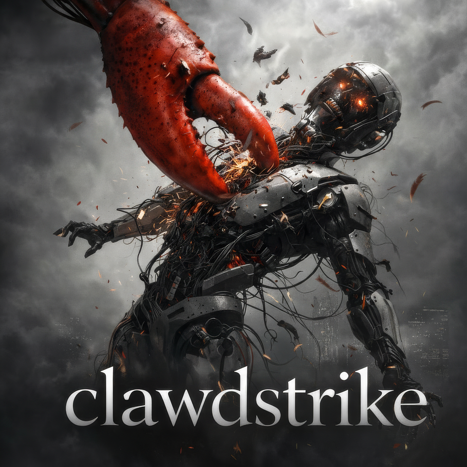

<p align="center">
  
</p>

<p align="center">
  <a href="https://github.com/backbay-labs/hushclaw/actions"></a>
  <a href="https://crates.io/crates/clawdstrike"></a>
  <a href="https://docs.rs/clawdstrike"></a>
  <a href="LICENSE"></a>
  
</p>

<p align="center">
  <em>
    The claw strikes back.<br/>
    At the boundary between intent and action,<br/>
    it watches what leaves, what changes, what leaks.<br/>
    Not "visibility." Not “telemetry.” Not "vibes." Logs are stories—proof is a signature.<br/>
    If the tale diverges, the receipt won't sign.
  </em>
</p>

<p align="center">
  
</p>

<p align="center">
  
  
</p>

<h1 align="center">Clawdstrike</h1>

<p align="center">
  <em>Fail closed. Sign the truth.</em>
</p>

<p align="center">
  <picture><source media="(prefers-color-scheme: dark)" srcset=".github/assets/sigils/boundary-dark.svg"></picture>&nbsp;Tool-boundary enforcement
   <span style="opacity:0.55;">&nbsp;&nbsp;&middot;&nbsp;&nbsp;</span>
  <picture><source media="(prefers-color-scheme: dark)" srcset=".github/assets/sigils/seal-dark.svg"></picture>&nbsp;Signed receipts
  <span style="opacity:0.55;">&nbsp;&nbsp;&middot;&nbsp;&nbsp;</span>
  <picture><source media="(prefers-color-scheme: dark)" srcset=".github/assets/sigils/plugin-dark.svg"></picture>&nbsp;Multi-framework
</p>

<p align="center">
  <a href="docs/src/getting-started/quick-start.md">Docs</a>
  <span style="opacity:0.55;">&nbsp;&nbsp;&middot;&nbsp;&nbsp;</span>
  <a href="docs/src/getting-started/quick-start-typescript.md">TypeScript</a>
  <span style="opacity:0.55;">&nbsp;&nbsp;&middot;&nbsp;&nbsp;</span>
  <a href="docs/src/getting-started/quick-start-python.md">Python</a>
  <span style="opacity:0.55;">&nbsp;&nbsp;&middot;&nbsp;&nbsp;</span>
  <a href="packages/clawdstrike-openclaw/docs/getting-started.md">OpenClaw</a>
  <span style="opacity:0.55;">&nbsp;&nbsp;&middot;&nbsp;&nbsp;</span>
  <a href="examples">Examples</a>
</p>

---

## Overview

> **Alpha Software** — This project is under active development and not yet published. Packages are not available on npm or crates.io. A full beta launch is planned for the coming week. APIs and import paths WILL change. Star/watch the repo to follow progress.

Clawdstrike provides runtime security enforcement for agents, designed for developers building EDR solutions and security infrastructure on top of OpenClaw.

 **Guards** — Block sensitive paths, control network egress, detect secrets, validate patches, restrict tools, catch jailbreaks

 **Receipts** — Ed25519-signed attestations proving what was decided, under which policy, with what evidence

 **Multi-language** — Rust, TypeScript, Python, WebAssembly

 **Multi-framework** — OpenClaw, Vercel AI, LangChain, Claude Code, and more

## Quick Start

### CLI (Rust)

```bash
cargo install --path crates/hush-cli

hush policy list
hush check --action-type file --ruleset strict ~/.ssh/id_rsa
```

### TypeScript (tool boundary)

TypeScript does not ship a full policy engine; use the Rust CLI/daemon for evaluation. `@clawdstrike/hush-cli-engine` requires `hush` on your PATH (or pass `hushPath`).

```typescript
import { createHushCliEngine } from "@clawdstrike/hush-cli-engine";
import {
  BaseToolInterceptor,
  createSecurityContext,
} from "@clawdstrike/adapter-core";

const engine = createHushCliEngine({ policyRef: "default" });
const interceptor = new BaseToolInterceptor(engine, { blockOnViolation: true });
const ctx = createSecurityContext({ sessionId: "session-123" });

const preflight = await interceptor.beforeExecute(
  "bash",
  { cmd: "echo hello" },
  ctx
);
if (!preflight.proceed) throw new Error("Blocked by policy");
```

### OpenClaw plugin

See `packages/clawdstrike-openclaw/docs/getting-started.md`.

## Highlights

| Feature                         | Description                                                                   |
| ------------------------------- | ----------------------------------------------------------------------------- |
| **7 Built-in Guards**           | Path, egress, secrets, patches, tools, prompt injection, jailbreak            |
| **4-Layer Jailbreak Detection** | Heuristic + statistical + ML + optional LLM-as-judge with session aggregation |
| **Output Sanitization**         | Redact secrets, PII, internal data from LLM output with streaming support     |
| **Prompt Watermarking**         | Embed signed provenance markers for attribution and forensics                 |
| **Fail-Closed Design**          | Invalid policies reject at load time; errors deny access                      |
| **Signed Receipts**             | Tamper-evident audit trail with Ed25519 signatures                            |

## Documentation

- [Design Philosophy](docs/src/concepts/design-philosophy.md) — Fail-closed, defense in depth
- [Guards Reference](docs/src/reference/guards/README.md) — All 7 guards documented
- [Policy Schema](docs/src/reference/policy-schema.md) — YAML configuration
- [Framework Integrations](docs/src/concepts/multi-language.md) — OpenClaw, Vercel AI, LangChain

## Security

We take security seriously. If you discover a vulnerability:

- **For sensitive issues**: Email [connor@backbay.io](mailto:connor@backbay.io) with details. We aim to respond within 48 hours.
- **For non-sensitive issues**: Open a [GitHub issue](https://github.com/backbay-labs/hushclaw/issues) with the `security` label.

## Contributing

Contributions welcome! See [CONTRIBUTING.md](CONTRIBUTING.md) for guidelines.

```bash
cargo build && cargo test && cargo clippy
```

## License

MIT License - see [LICENSE](LICENSE) for details.
