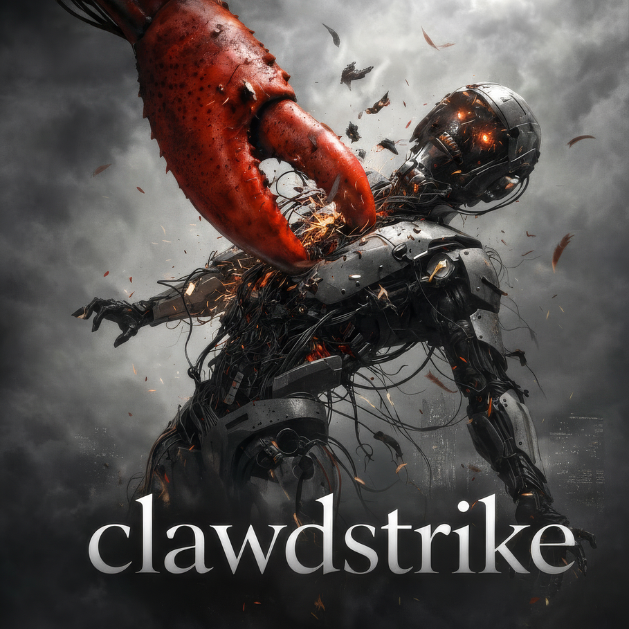
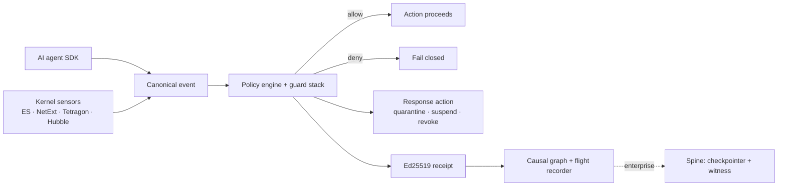

<p align="center">
  
</p>

<p align="center">
  <a href="https://github.com/backbay-labs/clawdstrike/actions"></a>
  <a href="https://www.npmjs.com/package/@clawdstrike/sdk"></a>
  <a href="https://pypi.org/project/clawdstrike/"></a>
  <a href="LICENSE"></a>
  <a href="https://discord.gg/fdbCZHm8zM"></a>
  
</p>

<h1 align="center">Clawdstrike</h1>

<p align="center">
  <strong>EDR for the age of the swarm.</strong><br/>
  <em>Fail closed. Sign the truth.</em>
</p>

> **Status: pre-1.0 beta.** Public APIs are stable; defaults may still tighten before 1.0.

Clawdstrike is a policy engine, an EDR, and a signed audit chain in one binary. An AI agent's `tool_call` sits in the same event taxonomy as a kernel-level `file_access`, `process_exec`, `network_flow`, `dylib_load`, or `launch_persistence`. One policy engine evaluates them. One Ed25519-signed causal graph records them. Defaults fail closed.

The same engine ships as a Rust crate, a TypeScript SDK, a Python package, a Go module, a CLI, a desktop EDR agent (macOS Endpoint Security + Network Extension; Linux Tetragon + Hubble), and an enterprise control plane.

<p align="center">
  <a href="#quick-start">Quick Start</a>
  &nbsp;·&nbsp;
  <a href="#guards">Guards</a>
  &nbsp;·&nbsp;
  <a href="#policies">Policies</a>
  &nbsp;·&nbsp;
  <a href="#formal-verification">Formal Verification</a>
  &nbsp;·&nbsp;
  <a href="#enterprise">Enterprise</a>
  &nbsp;·&nbsp;
  <a href="#design-principles">Design</a>
</p>

---

## Quick Start

Install via your preferred package manager:

```bash
brew install backbay-labs/tap/clawdstrike   # macOS, Linux
npm  install @clawdstrike/sdk               # TypeScript
pip  install clawdstrike                    # Python
cargo add clawdstrike                       # Rust
go   get github.com/backbay-labs/clawdstrike-go
```

Scaffold a project and start the daemon:

```bash
clawdstrike init --keygen
# writes policy.yaml, config.toml, keys/clawdstrike.key{,.pub}

clawdstrike daemon start && clawdstrike daemon status
# Status: healthy | Version: 0.2.7 | Uptime: 2s
```

Three denials, each signed:

```bash
$ clawdstrike check --action-type file --ruleset strict ~/.ssh/id_rsa
BLOCKED [Critical]: Access to forbidden path: ~/.ssh/id_rsa

$ clawdstrike check --action-type egress --ruleset strict api.openai.com:443
BLOCKED [Error]: Egress to api.openai.com blocked by policy

$ clawdstrike check --action-type mcp --ruleset strict shell_exec
BLOCKED [Error]: Tool 'shell_exec' is blocked by policy
```

Verify the policy itself compiles and is internally consistent:

```bash
$ clawdstrike verify --policy strict
Consistency:  PASS  (47 formulas, 0 conflicts)
Completeness: PASS  (4/4 action types covered)
Inheritance:  PASS  (0 weakened prohibitions)
```

Run a real agent under enforcement:

```bash
clawdstrike run --policy clawdstrike:strict -- python my_agent.py
```

The agent runs normally. Every tool call hits the engine first. Denials raise a typed error in your SDK and emit a signed receipt.

### Cluster: Helm chart and control plane

For fleet deployments, install the Helm chart. The default install brings up the enforcement + audit core: bundled NATS JetStream, the Spine audit chain (checkpointer + witness + proofs API), and `hushd`. The Control API (cloud enrollment + posture commands) and the kernel/L7 telemetry bridges are off by default; enable them with `--set`.

`hushd` and the Spine checkpointer + witness all ship fail-closed, so they require signing material at install time. The cleanest path is to pre-create Kubernetes Secrets and reference them from the chart:

```bash
NS=clawdstrike-system
kubectl create namespace "$NS"

# hushd: API key, admin key, auth pepper
kubectl -n "$NS" create secret generic clawdstrike-hushd-auth \
  --from-literal=CLAWDSTRIKE_API_KEY="$(openssl rand -hex 32)" \
  --from-literal=CLAWDSTRIKE_ADMIN_KEY="$(openssl rand -hex 32)" \
  --from-literal=CLAWDSTRIKE_AUTH_PEPPER="$(openssl rand -hex 32)"

# Spine: Ed25519 seeds for the checkpointer and witness signers
kubectl -n "$NS" create secret generic clawdstrike-spine \
  --from-literal=SPINE_LOG_SEED_HEX="$(openssl rand -hex 32)" \
  --from-literal=SPINE_WITNESS_SEED_HEX="$(openssl rand -hex 32)"

helm install clawdstrike \
  oci://ghcr.io/backbay-labs/clawdstrike/helm/clawdstrike \
  --version 0.2.0 \
  --namespace "$NS" \
  --set hushd.auth.existingSecret=clawdstrike-hushd-auth \
  --set spine.secrets.existingSecret=clawdstrike-spine
```

To bring up the full control plane (enrollment, posture commands, signed completion bundles back to the API), enable the Control API. It needs its own Secret (Postgres URL, JWT signing secret, and Stripe billing keys; use placeholder values if you are not running billing):

```bash
kubectl -n "$NS" create secret generic clawdstrike-control-api \
  --from-literal=DATABASE_URL="postgres://..." \
  --from-literal=JWT_SECRET="$(openssl rand -hex 32)" \
  --from-literal=STRIPE_SECRET_KEY="sk_test_placeholder" \
  --from-literal=STRIPE_WEBHOOK_SECRET="whsec_placeholder"

helm upgrade clawdstrike \
  oci://ghcr.io/backbay-labs/clawdstrike/helm/clawdstrike \
  --version 0.2.0 \
  --namespace "$NS" \
  --set hushd.auth.existingSecret=clawdstrike-hushd-auth \
  --set spine.secrets.existingSecret=clawdstrike-spine \
  --set controlApi.enabled=true \
  --set controlApi.secrets.existingSecret=clawdstrike-control-api \
  --set controlApi.env.NATS_PROVISIONING_MODE=mock \
  --set controlApi.env.NATS_ALLOW_INSECURE_MOCK_PROVISIONER=true
```

The mock provisioner is for non-production trials only. For a real deployment, leave `NATS_PROVISIONING_MODE=external` (the default) and set `controlApi.env.NATS_PROVISIONER_BASE_URL` to a control-plane endpoint that holds NATS admin credentials; otherwise enrollment will return `NATS provisioning is not configured`.

For local development off the repo, swap the OCI reference for `./infra/deploy/helm/clawdstrike` and keep the same `--set` flags.

| Component | Workload | Default | Purpose |
|---|---|---|---|
| `nats` | StatefulSet | on | JetStream transport for the Spine envelope |
| `spine-checkpointer` | Deployment | on | Hash-chained Ed25519 audit log |
| `spine-witness` | Deployment | on | Independent co-signature on checkpoints |
| `spine-proofs-api` | Deployment | on | Merkle-proof endpoint for receipts |
| `hushd` | Deployment | on | Centralised policy evaluation + receipt signing |
| `control-api` | Deployment | **off** (`--set controlApi.enabled=true`) | Tenant management, enrollment, posture commands |
| `tetragon-bridge` / `hubble-bridge` | DaemonSet / Deployment | off | Kernel + L7 telemetry into the Spine |

With Control API enabled, it issues single-use enrollment tokens that bind a Desktop Agent to a tenant over mTLS, then provisions per-agent NATS credentials. From there, posture commands flow Control API → NATS → agent, and signed completion bundles flow back. The Control Console (separate app at `apps/control-console/`) is the SOC operator UI on top of the API.

See [`infra/deploy/helm/clawdstrike/README.md`](infra/deploy/helm/clawdstrike/README.md) for chart parameters and [Enterprise enrollment](docs/src/guides/enterprise-enrollment.md) for the end-to-end agent onboarding flow.

---

## How it works


```mermaid
flowchart LR
    A[AI agent SDK] --> N
    K[Kernel sensors<br/>ES · NetExt · Tetragon · Hubble] --> N
    N[Canonical event] --> P[Policy engine + guard stack]
    P -->|allow| T[Action proceeds]
    P -->|deny| B[Fail closed]
    P --> R[Response action<br/>quarantine · suspend · revoke]
    P --> F[Ed25519 receipt]
    F --> G[Causal graph + flight recorder]
    G -.->|enterprise| S[Spine: checkpointer + witness]
```

Two input paths feed one policy engine. The SDK adapter normalises an AI agent's tool call into a canonical event; kernel sensors (macOS Endpoint Security and Network Extension; Linux Tetragon and Hubble) produce the same event shape for `file_access`, `process_exec`, `network_flow`, `dylib_load`, and `launch_persistence`. The guard stack returns a verdict bound to an Ed25519 receipt. Allowed actions proceed; denied actions fail closed.

Each receipt is content-hashed into a per-session causal graph that threads identity context (`agent_id`, `tool_call_id`, `workload_id`, `approval_id`) through every downstream OS event the decision touched. The graph and the raw observations are written to a disk-backed flight recorder with compaction and graph/history indices, so policies can be simulated against past state before they ship.

Response actions (`quarantine_file`, `restrict_egress`, `disable_persistence`, `revoke_grant`, `suspend_process_tree`, `terminate_process_tree`) produce their own signed `EndpointResponseExecutionEffect` and are reversible where possible. In enterprise mode the chain ships over NATS to the Spine checkpointer; an independent witness co-signs each batch.

> *Logs are stories; proof is a signature.*

---

## Guards

Each guard is a composable check at the tool boundary. Returns a verdict with evidence. Fail-fast or aggregate; configured per-policy.

| Guard | Catches |
|---|---|
| `ForbiddenPathGuard` | Access to `.ssh`, `.env`, `.aws`, credential stores, registry hives |
| `PathAllowlistGuard` | Whitelisted file access for least-privilege agents |
| `EgressAllowlistGuard` | Outbound network calls by domain (deny-by-default or allowlist) |
| `SecretLeakGuard` | AWS keys, GitHub tokens, private keys, API secrets in file writes |
| `PatchIntegrityGuard` | Dangerous patches like `rm -rf /`, `chmod 777`, `disable security` |
| `ShellCommandGuard` | Dangerous shell commands before execution |
| `McpToolGuard` | MCP tool invocations, with confirmation gates |
| `PromptInjectionGuard` | Injection attacks in untrusted input |
| `JailbreakGuard` | 4-layer detection: heuristic + statistical + ML + optional LLM judge |
| `ComputerUseGuard` | CUA actions: remote sessions, clipboard, input injection, file transfer |
| `RemoteDesktopSideChannelGuard` | Clipboard, audio, drive mapping, file transfer in CUA sessions |
| `InputInjectionCapabilityGuard` | Input injection capability restrictions for CUA environments |
| `SpiderSenseGuard` | Hierarchical threat screening: vector similarity, optional LLM escalation |

Source of truth: [`crates/libs/clawdstrike/src/guards/`](crates/libs/clawdstrike/src/guards/).

---

## Policies

Versioned, deterministic policy-as-code. Schema `1.5.0` (backward-compatible with `1.1.0`+). Supports `extends` from built-ins, local files, remote URLs, and git refs. Remote `extends` is host-allowlisted and integrity-pinned via `#sha256=<64-hex>`.

Built-in rulesets: `permissive` · `default` · `strict` · `ai-agent` · `ai-agent-posture` · `cicd` · `remote-desktop` · `remote-desktop-permissive` · `remote-desktop-strict` · `spider-sense`.

The operational loop (observe, synth, tighten):

```bash
# Generate a least-privilege candidate from observed events
clawdstrike policy synth run.events.jsonl \
  --extends clawdstrike:default --out candidate.yaml

# Replay the events against the candidate
clawdstrike policy simulate candidate.yaml run.events.jsonl --fail-on-deny

# Diff the candidate against the baseline
clawdstrike policy diff clawdstrike:default candidate.yaml
```

See [policy schema](docs/src/reference/policy-schema.md), [posture schema](docs/src/reference/posture-schema.md), and the [observe, synth, tighten guide](docs/src/guides/observe-synth.md).

---

## Formal verification

The policy engine's core decision logic is specified in Lean 4 and differentially tested against the Rust implementation via the [Aeneas](https://github.com/AeneasVerif/aeneas) translation pipeline.

**Proved in Lean (5 properties across 44 of 45 core functions):**

- Deny monotonicity: any guard denial denies the overall verdict
- Severity total order: ordering is consistent and transitive
- Cycle rejection: circular `extends` chains are always caught
- Signature roundtrip: Ed25519 sign-then-verify succeeds
- Disabled-guard allow: a disabled guard cannot produce a phantom deny

**Out of scope of the proof:** guards beyond the core decision logic, IO, network, and the crypto primitives themselves (we rely on `ed25519-dalek`).

```bash
clawdstrike verify --policy strict       # Z3 policy analysis
cargo test -p formal-diff-tests          # nightly differential tests
cd formal/lean4/ClawdStrike && lake build
```

See the [formal verification guide](docs/src/formal-verification.md).

---

## Receipts

Every verdict ships with an Ed25519-signed attestation containing the decision, the policy that made it, and the evidence. Receipts are canonicalised with RFC 8785 JSON Canonicalization, so a signature verifies byte-identically in Rust, TypeScript, and Python.

Enterprise deployments forward receipts through [Spine](crates/libs/spine/), an Ed25519-signed and hash-chained envelope log. Tamper any record and every later record fails verification.

---

## SDKs

### TypeScript

```bash
npm install @clawdstrike/sdk
```

```typescript
import { HushEngine, loadPolicy } from "@clawdstrike/sdk";

const engine = new HushEngine(await loadPolicy("clawdstrike:strict"));
const verdict = await engine.check({
  actionType: "file",
  target: "~/.ssh/id_rsa",
});
// verdict.decision === "deny"
// verdict.receipt is Ed25519-signed
```

### Python

```bash
pip install clawdstrike
```

```python
from clawdstrike import HushEngine, load_policy

engine = HushEngine(load_policy("clawdstrike:strict"))
verdict = engine.check(action_type="file", target="~/.ssh/id_rsa")
# verdict.decision == "deny"
```

### Rust

```toml
[dependencies]
clawdstrike = "0.2"
```

```rust
use clawdstrike::{HushEngine, Policy, Action, Decision};

let policy = Policy::load_builtin("strict")?;
let engine = HushEngine::new(policy);
let verdict = engine.check(&Action::file("~/.ssh/id_rsa"))?;
assert_eq!(verdict.decision, Decision::Deny);
```

### Go

```bash
go get github.com/backbay-labs/clawdstrike-go
```

```go
engine, _ := clawdstrike.NewEngine(clawdstrike.LoadBuiltin("strict"))
verdict, _ := engine.Check(clawdstrike.FileAction{Target: "~/.ssh/id_rsa"})
// verdict.Decision == clawdstrike.Deny
```

---

## Plugins

| Plugin | Install |
|---|---|
| **Claude Code** | [`clawdstrike-plugin/`](clawdstrike-plugin/) |
| **Cursor** | [`cursor-plugin/`](cursor-plugin/) |
| **OpenClaw adapter** | `npm install @clawdstrike/openclaw` ([guide](docs/src/guides/openclaw-integration.md)) |
| **Desktop Agent** | [`apps/agent/`](apps/agent/) |

---

## Enterprise

The same engine plus a managed control plane: Control API, NATS JetStream transport, Spine audit chain, and a Control Console for SOC workflow. Enrolment over mTLS, posture commands with request/reply acks, signed completion bundles back to the API.

See [enterprise enrollment](docs/src/guides/enterprise-enrollment.md) and [adaptive architecture](docs/src/concepts/adaptive-architecture.md).

---

## Compliance

Clawdstrike is **not** a certified product. It produces evidence that maps to standard control frameworks: signed action attestations, integrity-chained audit trails, deterministic policy evaluation.

| Framework | Evidence the engine produces |
|---|---|
| SOC 2 (CC6.1, CC7.2) | Logical access controls and signed audit trail |
| HIPAA §164.312(b) | Audit controls with non-repudiable receipts |
| PCI-DSS 10.5 | Tamper-evident, hash-chained logs |

Compliance mappings are draft. Open an issue if you need a framework formalised.

---

## Design principles

**Fail closed.** Invalid policies reject at load time. Evaluation errors deny access. Missing config defaults to restrictive. Security degradation requires explicit, auditable action.

**Proof, not logs.** Ed25519 receipts are cryptographic attestations, not log lines someone can edit. Canonical JSON (RFC 8785) ensures signatures verify identically in Rust, TypeScript, and Python.

**Same envelope, any pipe.** A signed Spine envelope is byte-identical whether it travels over NATS at 100K msg/sec, libp2p gossipsub over residential internet, or a LoRa radio at 1,200 bps. The transport is invisible to the truth layer.

**Attenuation only.** Agents delegate subsets of their capabilities, never escalate. Delegation tokens carry cryptographic capability ceilings. Privilege escalation isn't prevented by policy; it's prevented by math.

**Own your stack.** Apache-2.0. Self-hostable. No vendor dependency for security-critical infrastructure. The same engine runs on a developer laptop, an enterprise fleet, and a Raspberry Pi on a radio mesh.

---

## Documentation

| | |
|---|---|
| **Getting Started** | [Rust](docs/src/getting-started/quick-start.md) · [TypeScript](docs/src/getting-started/quick-start-typescript.md) · [Python](docs/src/getting-started/quick-start-python.md) |
| **Concepts** | [Design Philosophy](docs/src/concepts/design-philosophy.md) · [Enforcement Tiers](docs/src/concepts/enforcement-tiers.md) · [Multi-Language](docs/src/concepts/multi-language.md) |
| **Framework Guides** | [OpenAI](packages/adapters/clawdstrike-openai/README.md) · [Claude](packages/adapters/clawdstrike-claude/README.md) · [Vercel AI](docs/src/guides/vercel-ai-integration.md) · [LangChain](docs/src/guides/langchain-integration.md) · [OpenClaw](docs/src/guides/openclaw-integration.md) |
| **Reference** | [Guards](docs/src/reference/guards/README.md) · [Policy Schema](docs/src/reference/policy-schema.md) · [Repo Map](docs/REPO_MAP.md) |
| **Enterprise** | [Enrollment Guide](docs/src/guides/enterprise-enrollment.md) · [Adaptive Architecture](docs/src/concepts/adaptive-architecture.md) |

---

## Security

If you discover a vulnerability:

- Sensitive: email [connor@backbay.io](mailto:connor@backbay.io). 48-hour response.
- Non-sensitive: open a [GitHub issue](https://github.com/backbay-labs/clawdstrike/issues) with the `security` label.

See [`SECURITY.md`](SECURITY.md) and [`THREAT_MODEL.md`](THREAT_MODEL.md).

## Contributing

See [`CONTRIBUTING.md`](CONTRIBUTING.md).

```bash
cargo fmt --all && cargo clippy --workspace -- -D warnings && cargo test --workspace
```

## License

Apache License 2.0. See [`LICENSE`](LICENSE).
